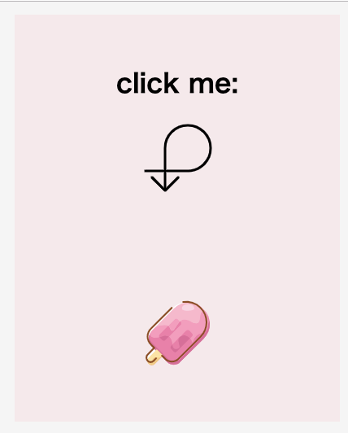

## Jirengu/Jirengu_task35/
This is a sample of how to swich cute icon with jQuery.And I also used colorful Icon Font.

### structure tree
```
|——index.html
|——style.css
```

### preview
[Preview](https://kisky3.github.io/Jirengu/Jirengu_task35/index.html)

