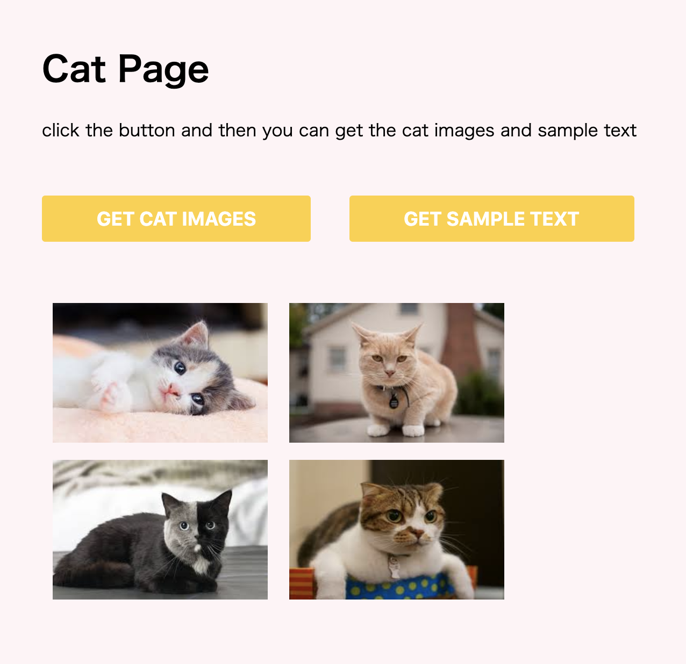
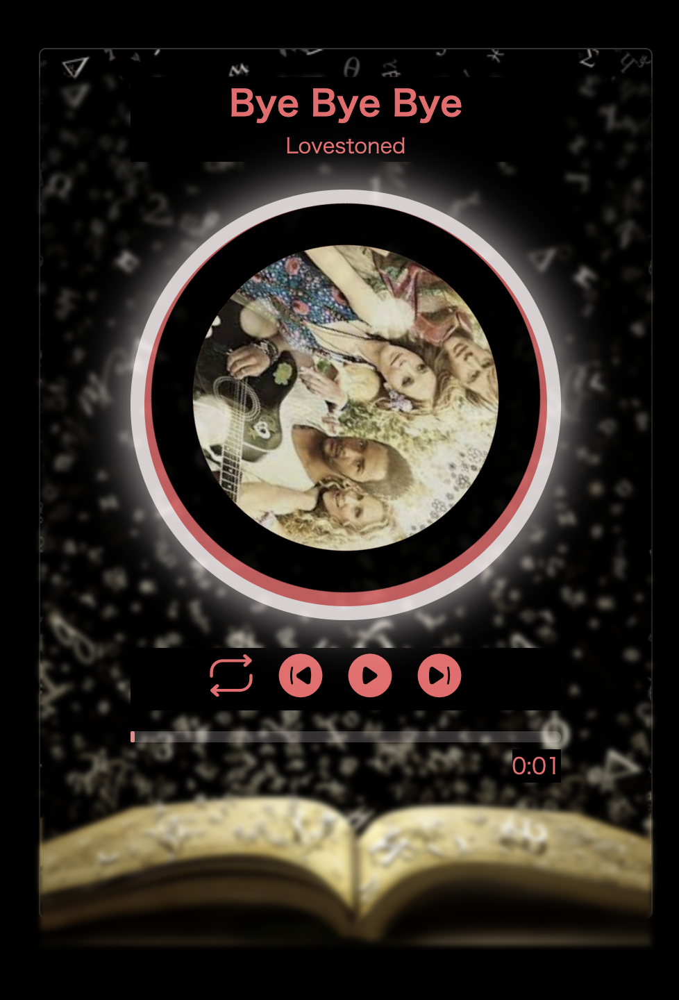

# HomeWork & Practice of Jirengu Class

## Jirengu/Jirengu_task8/
This is a practice of iconfont, no preview.

***

## Jirengu/Jirengu_task13/
This is a index page of LOL game ( League of Legends)

### preview
[Preview](https://kisky3.github.io/Jirengu/Jirengu_task13/index)


***

## Jirengu/Jirengu_task30/
This is a practice coding about node.js & express

### structure tree

```
server-sample
|——index.html
|——server.js
|——sample
      |——text.html
|——data
      |——cat01.jpg
      |——cat02.jpg
      |——cat03.jpg
      |——cat04.jpg
|——css
      |——style.css
```

### preview


### how to run
1. download node.js

2. run with comment below
```
node server.js
```

***
## Jirengu/Jirengu_task31/
I made a simple music player with JS audio API
This is just a practice coding about node.js & express

### structure tree
```
music-player
|——index.html
|——server.js
|——music
      |——ByeByeBye.mp3
      |——NeverChange.mp3
      |——ItIsYou.mp3
      |——Vendredi.mp3
      |——Stuttering.mp3
|——img
      |——01.jpg
      |——02.jpg
      |——03.jpg
      |——04.jpg
      |——05.jpg
|——css
      |——style.css
```

### preview
[Preview](https://kisky3.github.io/Jirengu/Jirengu_task31/music-player/index.html)


### how to run
1. download node.js

2. run with comment below
```
node server.js
```